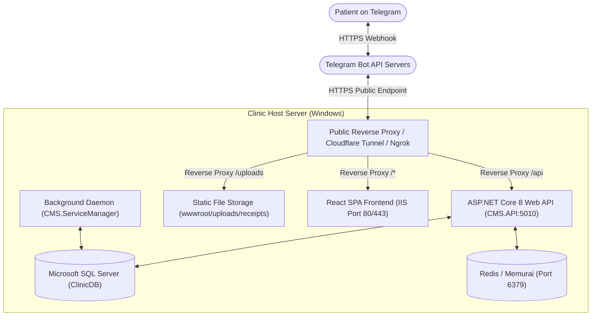

# Clinic Management System (CMS) — Complete Production Deployment Guide
## Deploying from GitHub with Telemedicine & Telegram Bot Subsystem

This document provides an end-to-end, step-by-step operational guide for deploying the **Clinic Management System (CMS)** directly from GitHub onto a fresh production or on-premise server (Windows Server 2019/2022 or Windows 10/11 Pro).

---

## Table of Contents
1. [Architecture & Component Diagram](#1-architecture--component-diagram)
2. [Prerequisites & Software Installation](#2-prerequisites--software-installation)
3. [Cloning from GitHub](#3-cloning-from-github)
4. [Database Initialization & Migration](#4-database-initialization--migration)
5. [Backend (.NET 8 Web API) Build & Hosting](#5-backend-net-8-web-api-build--hosting)
6. [Background Worker Service (CMS.ServiceManager)](#6-background-worker-service-cmsservicemanager)
7. [Frontend (React + Vite) Build & Hosting](#7-frontend-react--vite-build--hosting)
8. [Telemedicine & Telegram Bot Setup](#8-telemedicine--telegram-bot-setup)
9. [Reverse Proxy, Uploads & SSL Configuration](#9-reverse-proxy-uploads--ssl-configuration)
10. [End-to-End Verification & Troubleshooting](#10-end-to-end-verification--troubleshooting)

---

## 1. Architecture & Component Diagram



---

## 2. Prerequisites & Software Installation

Run an elevated PowerShell window (**Run as Administrator**) on the target host server.

### 2.1. Install Git for Windows
Download and install Git from [https://git-scm.com/download/win](https://git-scm.com/download/win) or via winget:
```powershell
winget install --id Git.Git -e --source winget
```

### 2.2. Install .NET 8 SDK & ASP.NET Core Hosting Bundle
The server requires the .NET 8 SDK to compile the source code, and the Hosting Bundle to run ASP.NET Core under IIS.
- Download [.NET 8.0 SDK](https://dotnet.microsoft.com/download/dotnet/8.0)
- Download [.NET 8.0 Hosting Bundle for Windows](https://dotnet.microsoft.com/download/dotnet/8.0)
Or install via PowerShell:
```powershell
winget install Microsoft.DotNet.SDK.8 -e
winget install Microsoft.DotNet.HostingBundle.8 -e
```

### 2.3. Install Node.js LTS (v18 or v20+)
Required to build the React Vite single-page application:
```powershell
winget install OpenJS.NodeJS.LTS -e
```
Verify installations:
```powershell
dotnet --version
node -v
npm -v
git --version
```

### 2.4. Install Microsoft SQL Server & SSMS
1. Install **Microsoft SQL Server 2019/2022** (Standard, Enterprise, or Express).
2. During setup:
   - Select **Mixed Mode Authentication** (SQL Server and Windows authentication).
   - Set the `sa` system administrator password (e.g. `say@123` or your secure clinic password).
3. Open **SQL Server Configuration Manager**:
   - Go to **SQL Server Network Configuration** > **Protocols for MSSQLSERVER** (or SQLEXPRESS).
   - Ensure **TCP/IP** is set to **Enabled**.
   - Right-click TCP/IP > Properties > IP Addresses > scroll to **IPAll** > set **TCP Port** to `1433` (or your chosen port such as `8710`).
   - Restart the SQL Server Windows Service.
4. Install **SQL Server Management Studio (SSMS)** to run schema scripts.

### 2.5. Install Redis / Memurai for Windows
CMS uses Redis for distributed caching, session tracking, and real-time queues.
- Download **Memurai Developer Edition** from [https://www.memurai.com/](https://www.memurai.com/) (fully compatible drop-in Redis replacement for Windows).
- Install as a Windows Service listening on standard port `6379`.
- Verify the service is running:
```powershell
Get-Service -Name Memurai
```

### 2.6. Install IIS & Necessary Modules
Enable IIS with required features:
```powershell
Enable-WindowsOptionalFeature -Online -FeatureName `
  IIS-WebServerRole, IIS-WebServer, IIS-CommonHttpFeatures, `
  IIS-StaticContent, IIS-DefaultDocument, IIS-HttpErrors, `
  IIS-ApplicationDevelopment, IIS-WebSockets, IIS-ManagementConsole
```

Install the two essential IIS extensions:
1. **[IIS URL Rewrite Module 2.1](https://www.iis.net/downloads/microsoft/url-rewrite)** (Required for React client-side route handling).
2. **[Application Request Routing (ARR) 3.0](https://www.iis.net/downloads/microsoft/application-request-routing)** (Required if proxying `/api` and `/uploads` requests to the Kestrel backend on port 5010).

---

## 3. Cloning from GitHub

Create your production application directory and clone the repository:

```powershell
# Create folder
New-Item -ItemType Directory -Force -Path "C:\CMS"
cd C:\CMS

# Clone the repository
git clone https://github.com/Biniyam0911/CMS.git .
```

---

## 4. Database Initialization & Migration

1. Launch **SQL Server Management Studio (SSMS)** and connect to your SQL Server instance using `sa` credentials.
2. Execute the setup scripts located in `C:\CMS\database` in the following sequence:

| Step | File / Directory | Purpose |
|------|-----------------|---------|
| 1 | `database/00_create_database.sql` | Creates `ClinicDB` database |
| 2 | `database/schema/01_tenants.sql` through `12_audit_and_cache.sql` | Core schema tables (Tenants, Users, Patients, Invoices, TelemedSessions, Settings) |
| 3 | `database/procedures/01_auth_procedures.sql` through `04_lab_procedures.sql` | Stored procedures for authentication, patients, billing, lab orders |
| 4 | `database/triggers/01_audit_triggers.sql` | System audit and history triggers |

3. Confirm that the Telemedicine and Receipt verification tables are created:
   - `PatientSocialIdentities`
   - `TelemedSessions`
   - `Invoices` (with `ReceiptImageUrl` and `PaymentMethod` columns)
   - `ClinicSettings` (with `Telemed.TelegramBotToken`, `Telemed.DefaultConsultationFee`, `TaxRate`)

---

## 5. Backend (.NET 8 Web API) Build & Hosting

### 5.1. Configure Connection Strings & Settings
Edit `C:\CMS\src\CMS.API\appsettings.json` (or create `appsettings.Production.json`):

```json
{
  "ConnectionStrings": {
    "DefaultConnection": "Server=127.0.0.1,1433;Database=ClinicDB;User Id=sa;Password=YourSecurePassword;Encrypt=False;TrustServerCertificate=True;MultipleActiveResultSets=True;Pooling=true;Min Pool Size=5;Max Pool Size=100;"
  },
  "Redis": {
    "ConnectionString": "localhost:6379"
  },
  "Jwt": {
    "Key": "ReplaceWithAStrongSecretKeyOfAtLeast32CharactersLong!",
    "Issuer": "CMS",
    "Audience": "CMS"
  },
  "AllowedHosts": "*"
}
```

### 5.2. Create Upload Storage Directory
Create the folder where patient payment transfer screenshots are stored:
```powershell
New-Item -ItemType Directory -Force -Path "C:\CMS\src\CMS.API\wwwroot\uploads\receipts"
```

### 5.3. Publish the API
Build and output compiled production binaries:
```powershell
cd C:\CMS
dotnet publish src/CMS.API/CMS.API.csproj -c Release -o C:\CMS\publish\api
```

Ensure the destination upload directory exists inside the publish folder as well:
```powershell
New-Item -ItemType Directory -Force -Path "C:\CMS\publish\api\wwwroot\uploads\receipts"
```

### 5.4. Host the API
You can run the API as a dedicated Windows Service:
```powershell
sc.exe create CMSApi binPath= "C:\CMS\publish\api\CMS.API.exe --urls=http://0.0.0.0:5010" start= auto
sc.exe description CMSApi "Clinic Management System Backend Web API"
sc.exe start CMSApi
```

Verify that the API is running by testing in a browser or PowerShell:
```powershell
Invoke-RestMethod -Uri "http://127.0.0.1:5010/api/v1/telemed/telegram/webhook"
# Should return: "Telegram webhook active."
```

---

## 6. Background Worker Service (CMS.ServiceManager)

The ServiceManager handles asynchronous background tasks, invoice status refreshes, and scheduled reports.

```powershell
cd C:\CMS
dotnet publish src/CMS.ServiceManager/CMS.ServiceManager.csproj -c Release -o C:\CMS\publish\service-manager

# Verify database connection string in C:\CMS\publish\service-manager\appsettings.json
# Register as a Windows Service:
sc.exe create CMSServiceManager binPath= "C:\CMS\publish\service-manager\CMS.ServiceManager.exe" start= auto
sc.exe description CMSServiceManager "Clinic Management System Background Worker Daemon"
sc.exe start CMSServiceManager
```

---

## 7. Frontend (React + Vite) Build & Hosting

### 7.1. Install Dependencies & Build Production Assets
```powershell
cd C:\CMS\frontend\cms-web
npm install
npm run build
```
This builds optimized HTML, CSS, and JavaScript bundles into `C:\CMS\frontend\cms-web\dist`.

### 7.2. Configure IIS Web Routing & Reverse Proxy
Create `C:\CMS\frontend\cms-web\dist\web.config` with the following content. This handles React SPA routing and routes API/upload traffic to the .NET 8 backend:

```xml
<?xml version="1.0" encoding="utf-8"?>
<configuration>
  <system.webServer>
    <rewrite>
      <rules>
        <!-- Route /api requests to .NET 8 Kestrel Backend -->
        <rule name="Proxy API" stopProcessing="true">
          <match url="^api/(.*)" />
          <action type="Rewrite" url="http://127.0.0.1:5010/api/{R:1}" />
        </rule>

        <!-- Route /uploads requests to static file storage -->
        <rule name="Proxy Uploads" stopProcessing="true">
          <match url="^uploads/(.*)" />
          <action type="Rewrite" url="http://127.0.0.1:5010/uploads/{R:1}" />
        </rule>

        <!-- React SPA Client Routes Fallback -->
        <rule name="React SPA" stopProcessing="true">
          <match url=".*" />
          <conditions logicalGrouping="MatchAll">
            <add input="{REQUEST_FILENAME}" matchType="IsFile" negate="true" />
            <add input="{REQUEST_FILENAME}" matchType="IsDirectory" negate="true" />
          </conditions>
          <action type="Rewrite" url="/" />
        </rule>
      </rules>
    </rewrite>
    <staticContent>
      <mimeMap fileExtension=".webp" mimeType="image/webp" />
    </staticContent>
  </system.webServer>
</configuration>
```

### 7.3. Configure IIS Website
1. Open **IIS Manager** (`inetmgr`).
2. Right-click **Sites** > **Add Website**:
   - **Site name**: `CMS_Web`
   - **Application pool**: `DefaultAppPool` (Set .NET CLR to **No Managed Code**)
   - **Physical path**: `C:\CMS\frontend\cms-web\dist`
   - **Port**: `80` (or `443` with an SSL certificate)
3. Under **Application Request Routing (ARR)** in the IIS root server node:
   - Double-click **Application Request Routing Cache**.
   - Click **Server Proxy Settings** in the right actions pane.
   - Check **Enable proxy**.
   - Click **Apply**.

---

## 8. Telemedicine & Telegram Bot Setup

The Telemedicine module connects Telegram to your clinic system. Patients register, pick a doctor, and send payment receipts through Telegram.

### 8.1. Create a Bot via Telegram's @BotFather
1. Open the Telegram app and search for `@BotFather`.
2. Send `/newbot`.
3. Enter a display name for your clinic bot (e.g. `Huderma Clinic Bot`).
4. Enter a username ending with `bot` (e.g. `Huderma_bot`).
5. Copy the generated **HTTP API Token** (e.g. `8215614286:AAH-0jSn8wCK5-wctKskfSY6v_OLUhOMgtk`).

### 8.2. Save the Bot Token in the Database
Run this query in SSMS:
```sql
UPDATE ClinicSettings
SET SettingValue = 'YOUR_TELEGRAM_BOT_TOKEN_HERE'
WHERE SettingKey = 'Telemed.TelegramBotToken' AND TenantId = 1;
```

### 8.3. Expose the Webhook with Public HTTPS
Telegram webhooks **strictly require a public HTTPS URL with valid SSL**.

#### Method A: Cloudflare Tunnel (Free, Permanent, Recommended for Clinics)
1. Download `cloudflared-windows-amd64.exe` from [Cloudflare Releases](https://github.com/cloudflare/cloudflared/releases).
2. Rename to `cloudflared.exe` and place in `C:\CMS\tools\`.
3. Run as an ad-hoc or persistent tunnel:
```powershell
C:\CMS\tools\cloudflared.exe tunnel --url http://127.0.0.1:5010
```
Cloudflare will provide a permanent HTTPS URL, for example: `https://clinic-telemed.yourdomain.com` or `https://xyz.trycloudflare.com`.

#### Method B: Ngrok (Fast for Testing)
```powershell
ngrok http 5010
```
Provides a public HTTPS URL such as `https://mashed-outspoken-hurled.ngrok-free.dev`.

#### Method C: Static Public IP / Domain with Let's Encrypt / IIS SSL
If your clinic has a static public IP and domain (e.g. `https://api.clinic.com`), bind port 443 with your SSL certificate.

---

### 8.4. Register the Webhook with Telegram
Once your public HTTPS domain is live, register it with Telegram API using PowerShell:

```powershell
$BOT_TOKEN = "YOUR_TELEGRAM_BOT_TOKEN_HERE"
$PUBLIC_URL = "https://your-public-domain.com"

# Set the webhook URL
Invoke-RestMethod -Method Post -Uri "https://api.telegram.org/bot$BOT_TOKEN/setWebhook?url=$PUBLIC_URL/api/v1/telemed/telegram/webhook"
```

Telegram should respond:
```json
{
  "ok": true,
  "result": true,
  "description": "Webhook was set"
}
```

### 8.5. Verify Webhook Health
Inspect the webhook connection status:
```powershell
Invoke-RestMethod -Uri "https://api.telegram.org/bot$BOT_TOKEN/getWebhookInfo"
```
Ensure:
- `"url"` points to your public HTTPS endpoint.
- `"has_custom_certificate"` is `false`.
- `"pending_update_count"` is `0` (or draining).
- `"last_error_message"` is empty or null.

---

## 9. Reverse Proxy, Uploads & SSL Configuration

### File Uploads Security & Access Permissions
The backend writes uploaded payment receipt images to `publish/api/wwwroot/uploads/receipts/`. Grant write permissions:

```powershell
icacls "C:\CMS\publish\api\wwwroot\uploads" /grant "Users:(OI)(CI)M" /T
icacls "C:\CMS\publish\api\wwwroot\uploads" /grant "NETWORK SERVICE:(OI)(CI)M" /T
```

### Firewall Rules
Allow local clinic devices to access the system:
```powershell
New-NetFirewallRule -DisplayName "CMS Web App (HTTP 80)" -Direction Inbound -LocalPort 80 -Protocol TCP -Action Allow
New-NetFirewallRule -DisplayName "CMS Web App (HTTPS 443)" -Direction Inbound -LocalPort 443 -Protocol TCP -Action Allow
New-NetFirewallRule -DisplayName "CMS API (TCP 5010)" -Direction Inbound -LocalPort 5010 -Protocol TCP -Action Allow
```

---

## 10. End-to-End Verification & Troubleshooting

### 10.1. Complete Verification Walkthrough
1. **Frontend App**: Open a browser on a client computer to `http://<SERVER-IP>`. Login with SuperAdmin credentials.
2. **Settings**: Navigate to **Clinic Settings**. Confirm Tax Rate, Clinic Name, and Currency are set correctly.
3. **Telemedicine Queue**: Navigate to **Telemedicine Queue** (`/telemed`). Check that the date picker, Today/All Dates toggle, and pagination load properly.
4. **Service Management**: Navigate to **Services & Lab** (`/services`). Verify the search bar filters Clinical Services, Lab Catalog, and Categories.
5. **Telegram Bot Flow**:
   - Open Telegram on a mobile device and search for `@YourClinicBot`.
   - Tap `/start`.
   - Bot asks for mobile number ➔ Enter phone.
   - Bot asks for full name ➔ Enter name.
   - Bot asks for age & biological gender ➔ Provide details.
   - Bot shows attending doctors list ➔ Tap a doctor.
   - Bot creates an Invoice and displays payment transfer instructions with bank account info.
   - Send a screenshot photo of a bank transfer receipt.
   - In CMS web app under **Billing & Invoices**:
     - Verify the telemedicine invoice appears in pending status.
     - Click **View Receipt** to inspect the patient's payment screenshot.
     - Click **Confirm Transfer & Send Telegram Verification**.
     - Verify on the patient's Telegram that an instant confirmation is received, and the session appears in the Doctor's **Telemedicine Queue** ready for consultation!

### 10.2. Troubleshooting Guide

| Issue | Cause | Solution |
|---|---|---|
| Bot does not reply to `/start` | Webhook not set or tunnel down | Check `getWebhookInfo`. Ensure `cloudflared` or `ngrok` is running. |
| Telegram returns HTTP 400 or SSL error | Telegram requires valid public HTTPS | Ensure SSL certificate is valid and not self-signed. Use Cloudflare Tunnel if on-premise without a domain. |
| Uploaded receipt shows broken image in Billing | Missing `wwwroot/uploads/receipts` or static files not mapped | Ensure directory exists in API root and IIS reverse proxy rule for `^uploads/(.*)` is present. |
| API returns 500 on database queries | SQL connection string or TCP/IP disabled | Check SQL Server Configuration Manager; verify TCP/IP is enabled on port 1433/8710 and credentials match `appsettings.json`. |
| Client-side routes (e.g. `/billing`) return 404 on page refresh | Missing URL Rewrite module or `web.config` | Ensure URL Rewrite 2.1 is installed in IIS and `web.config` exists in the React SPA folder. |
